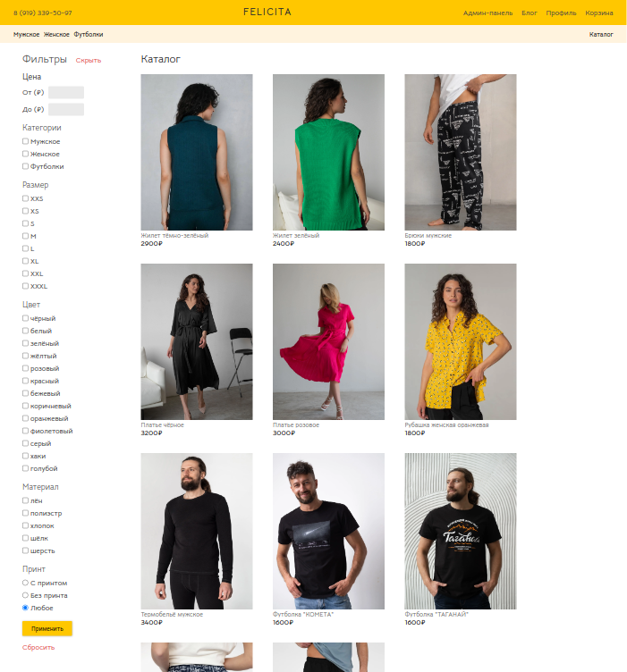
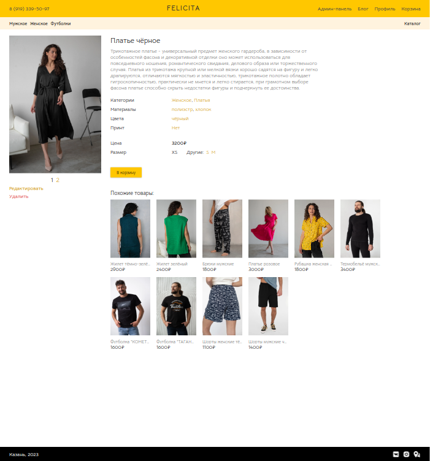
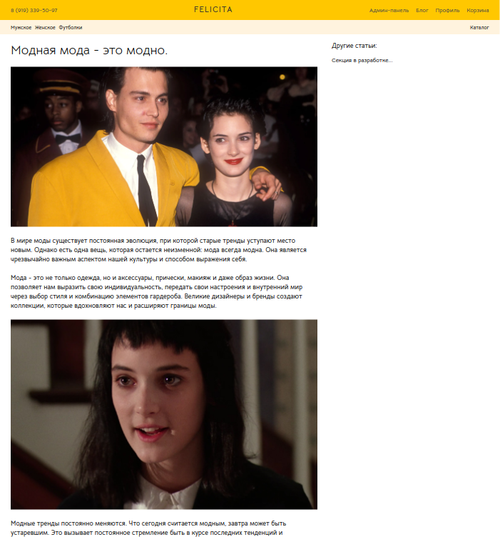

# Felicita

*Main page*


*Catalog page*



*Item page*



*Article page*



Check out the full design: [Figma](https://www.figma.com/file/qyiGaOFrYI4lSQs88XOcDn/Felicita?type=design&node-id=0%3A1&mode=design&t=RygDKDx8vw7nRkH4-1)

## Project description

Felicita is an online clothing store with a user-friendly adaptive interface.
Explore diverse range of products, add them to cart, and easily reserve items for future 
purchase. You can conveniently filter products based on various parameters to find exactly 
what you're looking for.

In addition to shopping, the website features a blog where you can read articles on different topics.

For administrators, there is a dedicated section to manage the website's content. Create and edit 
products, update quantities, write blog posts, and review reserved items and callback requests.

## Stack

#### Backend

- Java 17
- Spring Boot 3 (incl. sping oauth2 client)
- Maven
- Liquibase
- PostgreSQL

#### Frontend

- Node.js
- React
- editorjs

## Running the application locally

#### Using docker compose

All website components (frontend, backend, database) are available to run from Docker:

```shell
git clone https://github.com/ynovice/felicita
cd felicita
docker-compose build
docker-compose up
```

It may take a few minutes to generate the docker images. Once the images have been successfully built and the
containers run, you can go to http://localhost:3000/ to get to the home page of the site.

In order to make the first user an administrator, you need to change their role from USER to ADMIN in the database.